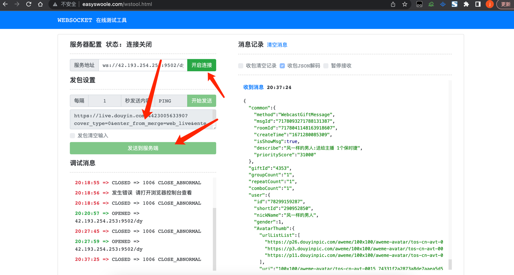

# 抖音快手弹幕服务端

## 服务框架 Hyperf

 - PHP >= 7.3
 - Swoole PHP extension >= 4.5，and Disabled `Short Name`
 - OpenSSL PHP extension
 - JSON PHP extension
 - PDO PHP extension 
 - Redis PHP extension 
 - Protobuf PHP extension 

## 运行
```bash
// 更新composer依赖

composer update -o

// 启动项目

composer start
```

## 连接测试


## websocket路由地址
- ws://ip:9502/ks (快手)
- ws://ip:9502/dy (抖音)

## 心跳维持要求
+ 连接完服务端后请每隔4分钟向服务端发送内容为`ping`的数据，否则5分钟不发送数据服务端会自动断开

## 项目定制
- 语言方向🧭：易语言、php、python、Go、Java
- 合作or收徒联系📮：wuaiyiyun2022@163.com
